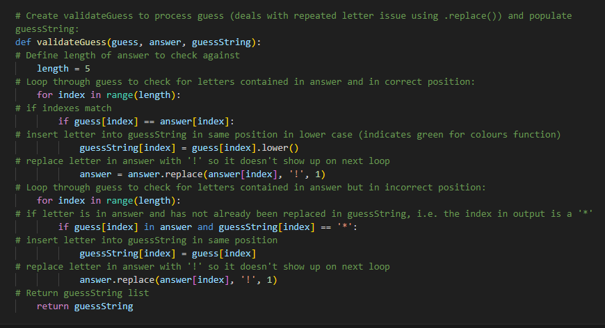

# Wordoodle

## A terminal based word game inspired by Wordle

### Project goals
I have recently been learning the basics of Python as part of Generation UK & Irelands's AWS re/Start Cloud Practioner programme. Building this game seemed like a good way to practice using some of the concepts I've learned so far, including declaring variables, creating and manipulating lists, and executing conditionals using for and while loops and if statements.
Wordle is a game I play regularly in my life so it felt like a good option as I am familiar with the game.

### User Stories
From the perspective of the player:

- As someone who enjoys word games, I want to be able play whenever I want on my desktop or laptop

- As someone who enjoys word games and also enjoys developing, I want to be able to play directly in my IDE terminal

- As someone who who enjoys Wordle, I want to be able to play a game that is similar

From the perspective of the developer:

- As a python developer, I want to build a project that utilises variable, lists and loops in order to practice my skills

- As a python developer, I want to build something that can be easily tested/debugged in the terminal as I go along

- As a python developer, I want to build a version of something that is already familiar to me in order to flatten the learning curve

### Design Choices

I decided to have a Start screen which welcomed the user, gave them some instructions for how to play, and asks the user to input a username:

I decided to make the game terminal based which by default means the game would be in black and white, however I wanted to include colours in order to differentiate the different letter positions in the user input, i.e. 'print green' for correct position, 'print red' for incorrect position, 'print yellow *' for incorrect letter. I used the colorama library to achieve this result:

### Technologies Used

Pyhton, Git, Github

### Challenges

The biggest challenge I ran into was dealing with a use case where the guess contained more than one occurence of a letter contained in the answer, e.g. guess = 'LEAVE', answer = 'DRONE'.

My initial code output was showing both E's in LEAVE as being present in DRONE, however the desired output would be for the correct E to be marked green (i.e. correct) and the surplus E to be marked as a yellow * (i.e. incorrect).

The fix for this was to replace each letter in the answer with a non-alphabetical character (I used '!') so that when the loop continues the surplus letter doesn't show up:

### Credits
I would like to credit the creator of Wordle, Josh Wardle, for inspiring this project.